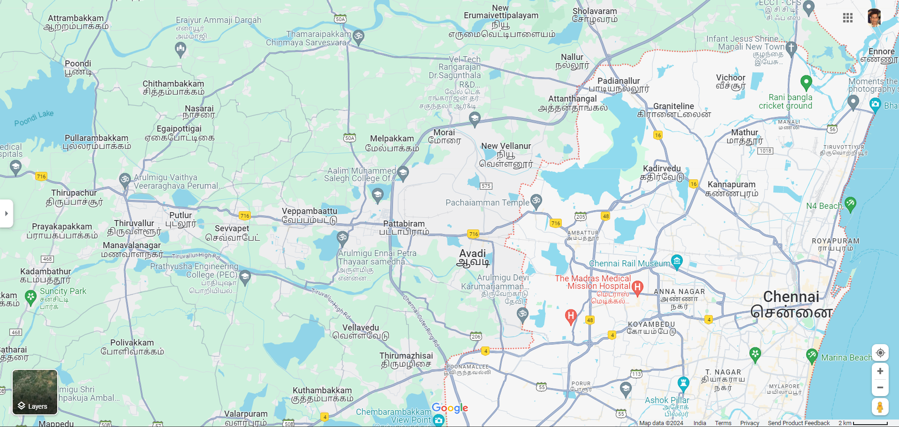

# Ex04 Places Around Me
## Date: 30.3.24

## AIM
To develop a website to display details about the places around my house.

## DESIGN STEPS

### STEP 1
Create a Django admin interface.

### STEP 2
Download your city map from Google.

### STEP 3
Using ```<map>``` tag name the map.

### STEP 4
Create clickable regions in the image using ```<area>``` tag.

### STEP 5
Write HTML programs for all the regions identified.

### STEP 6
Execute the programs and publish them.

## CODE
```
karthick.html

<html>
    <head>
        <title>CHENNAI CITY</title>
    </head>
    <body bgcolor="white">
        <h1 align="center">

        <font color="maroon">CHENNAI</font>
        </h1>
        <h2 align="center"
        <font color="black">KARTHICK KISHORE T</font>
        </h2>
        <h3 align="center">
        <font color="black">212223220042</font>
        </h3>
        

            <map name="image-map">
                <area target="" alt="TIRUVOTTIYUR" title="HOMETOWN" href="hometown.html" coords="1744,309,1846,336" shape="rect">
                <area target="" alt="Avadi" title="AVADI" href="avadi.html" coords="954,526,1064,573" shape="rect">
                <area target="" alt="Marina Beach" title="MARINA BEACH" href="beach.html" coords="1716,746,1871,776" shape="rect">
                <area target="" alt="Ashok Pillar" title="ASHOK PILLAR" href="tourism.html" coords="1431,864,53" shape="circle">
                <area target="" alt="Chennai Rail Museum" title="CHENNAI RAIL MUSEUM" href="museum.html" coords="1245,543,1448,579" shape="rect">
        </map>
    </center>
    </body>
</html>


hometown.html

<html>
    <head>
        <title>MY HOMETOWN</title>
    </head>
    <body bgcolor="white">
        <h1 align="center">
            <font color="maroon"><b>CHENNAI</b></font>
        </h1>
        <h3 align="center">
            <font color="maroon"><b>THIRUVOTTIYUR - MY HOMETOWN</b></font>
        </h3>
        <hr size="3" color="red">
        <p align="justify">
            <font face="Georgia" size="5">
                Tiruvottriyur (Thiruvottiyur or TVT) is a neighbourhood in North Chennai, administered by the Greater Chennai Corporation. It is part of the Tondiarpet division, located to the north of Chennai. It is one of the fifteen administrative zones in the Greater Chennai Corporation. The zone is called Zone 1 (Tiruvottriyur).

Tiruvottriyur has industrial units, trading activity, and nearby fishing hamlets. The area is easily accessible by Metropolitan Transport Corporation (MTC) buses from across the city and has a bus terminus. The area is also served by the Tiruvottiyur railway junction of the Chennai Suburban Railway Network. As of 2011, the neighbourhood had a population of 249,446.
            </font>
        </p>
    </body>
</html>

museum.html

<html>
    <head>
        <title>MY HOMETOWN</title>
    </head>
    <body bgcolor="white">
        <h1 align="center">
            <font color="maroon"><b>CHENNAI</b></font>
        </h1>
        <h3 align="center">
            <font color="maroon"><b>CHENNAI RAIL MUSEUM</b></font>
        </h3>
        <hr size="3" color="red">
        <p align="justify">
            <font face="Georgia" size="5">
                The Chennai Rail Museum is a railway museum in Chennai, Tamil Nadu, India. The museum opened on 16 April 2002 in the Furnishing Division of the Integral Coach Factory (ICF) near Perambur. The 6.25-acre (2.53 ha) museum has technical and heritage exhibits, with a sizable collection of steam engines from the British Raj. It also has vintage coaches (such as Ooty trains), which were endemic on Indian railways. Most of the older models were manufactured by the North British Locomotive Company,[1] with some trains in the collection dating back more than a century.[2] Toy-train rides are available. There are 3 air-conditioned Indoor Galleries (ICF Gallery, Rail History Gallery, Art Gallery, 2 Other Non-airconditioned Galleries, a 90-seater air-conditioned Dolby Digital Movie Theatre (Railway and Railway Heritage Films), Natyarangam, Amphitheatre, a Number of Metal Sculptures made from scrap, 3D MURAL at the entrance, Cartoon Hero Characters better viewed from the Joyous Toy Train Ride, Rail Coach Restaurant, Eco Green Park, Lust Green vegetation, etc., The museum is managed and maintained by the ICF.
            </font>
        </p>
    </body>
</html>

tourism.html

<html>
    <head>
        <title>MY HOMETOWN</title>
    </head>
    <body bgcolor="white">
        <h1 align="center">
            <font color="maroon"><b>CHENNAI</b></font>
        </h1>
        <h3 align="center">
            <font color="maroon"><b>ASHOK PILLAR</b></font>
        </h3>
        <hr size="3" color="red">
        <p align="justify">
            <font face="Georgia" size="5">
                Ashok Nagar is a residential locality situated at the southern part of Chennai, Tamil Nadu, India. It was established in 1964. At the heart of this colony, stands the Ashok Pillar. This four lion head stump, resembles the one erected by king Ashoka during the 3rd century BCE at Sanchi.
            </font>
        </p>
    </body>
</html>

avadi.html

<html>
    <head>
        <title>MY HOMETOWN</title>
    </head>
    <body bgcolor="white">
        <h1 align="center">
            <font color="maroon"><b>CHENNAI</b></font>
        </h1>
        <h3 align="center">
            <font color="maroon"><b>AVADI</b></font>
        </h3>
        <hr size="3" color="red">
        <p align="justify">
            <font face="Georgia" size="5">
                Avadi is a western suburb of Chennai, and the headquarters of Avadi taluk located within the Thiruvallur district of Tamil Nadu, India. Situated at about 22 kilometres (14 mi) from Chennai Central Railway Station, it is one of the four municipal corporations in the Chennai Metropolitan Area and is governed by the Avadi Municipal Corporation
            </font>
        </p>
    </body>
</html>

beach.html

<html>
    <head>
        <title>MY HOMETOWN</title>
    </head>
    <body bgcolor="white">
        <h1 align="center">
            <font color="maroon"><b>CHENNAI</b></font>
        </h1>
        <h3 align="center">
            <font color="maroon"><b>MARINA BEACH</b></font>
        </h3>
        <hr size="3" color="red">
        <p align="justify">
            <font face="Georgia" size="5">
                Marina Beach, or simply the Marina, is a natural urban beach in Chennai, Tamil Nadu, India, along the Bay of Bengal. The beach runs from near Fort St. George in the north to Foreshore Estate in the south, a distance of 6.0 km (3.7 mi) making it the second longest urban beach in the world, after Cox's Bazar Beach. It is a prominent landmark in Chennai.
            </font>
        </p>
    </body>
</html>


```

## OUTPUT

.png>)
.png>)
.png>)
.png>)
.png>)
.png>)

## RESULT
The program for implementing image maps using HTML is executed successfully.
